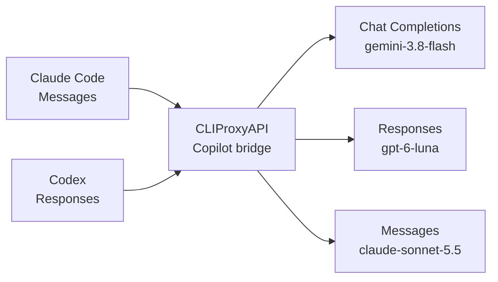

# Copilot Bridge

A native CLIProxyAPI v8 plugin for GitHub Copilot subscription models.
The plugin handles device login, Copilot token refresh, model discovery, and upstream execution.
It derives from the MIT-licensed Copilot plugin [v0.3.3](https://github.com/arthur-sommer-etc/cliproxyapi-copilot-plugin/tree/v0.3.3).
See [NOTICE.md](NOTICE.md) for attribution.

## Requirements

- Go 1.26.8 or newer and a C compiler for the native shared library.
- CLIProxyAPI v8 with its native plugin loader enabled.
- A GitHub account with access to Copilot subscription models.

The plugin builds against SDK v8.0.15 and requires [CLIProxyAPI fork release `v8.0.15-cpa.1`](https://github.com/ririnto/CLIProxyAPI/tree/v8.0.15-cpa.1), based on upstream v8.0.15.
Build the host and plugin for the same operating system and architecture.

## Build and Install

```bash
go tool task check
```

The native artifact is written to `build/plugins/<os>/<arch>/cliproxyapi-copilot.<ext>`.
The extension is `dylib` on macOS, `so` on Linux, and `dll` on Windows.
Copy the artifact into `<plugin-root>/<os>/<arch>/` and configure the host using [config.yaml](config/config.yaml).
Restart the host after installing a new native library.
The plugin identifier is `copilot`.
The configuration key is the library basename, `cliproxyapi-copilot`.

```yaml
plugins:
  enabled: true
  dir: ./plugins
  configs:
    cliproxyapi-copilot:
      enabled: true
      reasoning_replay: true
      prompt_cache_key: true
      compaction_models: []
      model_endpoint_overrides: {}
```

Keep authentication files in a private directory outside the checkout.
Protect the host management endpoint with its configured management key.

## Login

Use the host OAuth management API with `provider=copilot`.
The plugin starts GitHub device authorization and exchanges the approved credential for a Copilot API token.
The host stores the GitHub credential through its normal auth storage.
The plugin refreshes short-lived Copilot tokens in memory.
Each request refreshes a Copilot token if it expires within the default five-minute buffer.
Configure the buffer with `token_expiry_buffer_seconds`.
On an upstream 401, the bridge invalidates its cached Copilot token.
The bridge retries model discovery once with the renewed token.
JSON and SSE execution retry once only when the API origin stays unchanged.
An origin change returns HTTP 409 before the bridge sends the prepared request to the new origin.
Start a new conversation after an API origin change.
The bridge refreshes a GitHub OAuth credential near expiry only when it has a refresh token.
The host persists rotated GitHub credentials returned through its normal auth callback.
Non-expiring GitHub credentials need no OAuth refresh, but the plugin still mints short-lived Copilot tokens.
Token refresh uses the configured OAuth permissions and adds no new scope requirements.
The bridge treats GitHub's `invalid_grant` marker as a terminal refresh failure.
The bridge preserves GitHub's 400 or 401 status and omits the upstream response body.

```text
GET /v8/management/oauth/auth-url?provider=copilot
GET /v8/management/oauth/status?state=<returned-state>
```

Open the returned GitHub device URL, approve access, and poll until the status is `ok`.
Send your host client API key to inference endpoints.
Do not send the GitHub credential to clients.

## Model Availability

The bridge builds its model list from authenticated Copilot upstream inventory.
It includes entries with no policy state or `policy.state=enabled`.
It hides other policy states, `model_picker_enabled=false`, explicit non-chat capability types, and models without a supported chat endpoint.
Missing picker or capability metadata retains legacy-visible behavior.
An explicit non-enabled policy blocks endpoint overrides.
Models hidden only by the picker require an explicit endpoint override.
Configured excluded prefixes apply to discovery and default dispatch.
A valid inventory with no eligible models returns an empty list.
A refresh failure returns the upstream error instead of serving the plugin's expired snapshot.
The failure does not permanently exclude models from a later successful inventory.

## Protocol Behavior

The bridge retains provider state on native `/responses`, `/v1/messages`, and `/chat/completions` paths.
The plugin prefers the client's native endpoint when the model advertises it.
Responses requests prefer `/responses`.
When a Claude-family model has no Responses endpoint, the plugin prefers `/v1/messages` over Chat Completions.
Claude and Chat clients retain their native endpoint preference.
An exact model override can select an endpoint when discovery metadata is incomplete.

Each client can use each configured Copilot endpoint through the bridge.
The graph shows endpoint types and public model IDs.



The bridge preserves native content blocks, block order, and opaque identifiers on same-format routes.
Across formats, the bridge translates supported tool-call input and carries opaque reasoning through reversible carriers.
Responses-to-Chat routes use a reversible carrier when item and call IDs differ or are unsafe.
Matching tool-result IDs reuse the carrier across later turns.
Copilot can issue opaque tool item IDs longer than 64 characters.
The bridge preserves them and lets Copilot validate native request IDs.
Chat and Claude carriers preserve separate item and call IDs without truncation.
Malformed or unknown reserved carrier versions fail closed.
For Chat opaque state, the inner carrier preserves the exact opaque JSON value.
The authenticated outer wrapper binds Chat replay to the selected auth entry, API origin, model, and endpoint.
A random account-bound root in provider-owned auth data protects wrappers and compaction capsules.
Verified same-account GitHub OAuth refresh, short-lived Copilot token renewal, and process restart preserve that root.
New sign-in creates a new account-bound root.
Direct credential replacement invalidates existing replay state with HTTP 409 and requires a new sign-in.
Legacy wrappers and capsules migrate only after verifying the current GitHub token, account, and Copilot API origin.
The bridge rejects caller-supplied v1 carrier data without its authenticated wrapper.
Each cross-format route handles only its defined block types.
The bridge rejects non-empty blocks without a target mapping instead of dropping them.
Opaque replay requires the matching Copilot scope and a unique assistant or tool-call anchor.
The bridge rejects opaque conversions that cannot retain verification data and tool identifiers it cannot represent safely.
Foreign signed or encrypted reasoning sent to Chat returns HTTP 422 instead of placeholder text.
The bridge preflights request, response, and SSE shapes and returns errors when conversion would drop content.
Native Responses routes preserve `previous_response_id` references.
Chat Completions and Messages routes cannot resolve server-side Responses context.
Those routes reject a meaningful `previous_response_id` value.
Send full input history for cross-format turns that use prior Responses context.
The bridge keeps Claude signed thinking and redacted thinking intact on the native Messages path.
Claude-to-Responses requests set `store: false` and request the `reasoning.encrypted_content` include for follow-up turns.
The bridge carries Claude signatures and separate tool identifiers through reversible protocol carriers.
Claude root effort values, including `xhigh` and `max`, pass to Responses unchanged.
Legacy Claude thinking budgets map only to `low`, `medium`, or `high`.
A supported empty system-message effort marker supplies the root value only when it is absent.
The bridge maps Claude adaptive `thinking.display=updates` to Messages `summarized`.
It treats `clear_thinking_20251015` with `keep=all` as a no-op and preserves all history blocks.
The bridge rejects other keep edits, unknown context edits, or unsupported non-empty server-side safety settings.
Claude-to-Responses requests use `reasoning.summary=auto` and the mapped reasoning effort.
Responses-to-Claude conversion accepts `encrypted_index` citation annotations.
Other citation annotations and unknown meaningful output blocks return errors.
Claude cache hints use Responses implicit prefix caching regardless of `prompt_cache_key` configuration.
The setting defaults to true and adds a stable caller or session root key, with caller keys taking priority.
The bridge omits generated keys without stable session identity.
Responses caching cannot reproduce Claude's exact TTL.
Stream conversion reconciles terminal-only output and usage before closing the client stream.
Fail the stream when the terminal event is missing or unsuccessful.

## Claude Code Permissions

Use `--permission-mode manual` with local read and command allowlists when Claude Code uses Copilot.
Copilot cannot enforce Claude's server-side automatic permission classification.
The bridge rejects non-empty server-side safety settings that Copilot cannot enforce.

Reasoning replay can restore missing reasoning next to matching tool calls in the same account, model, session, and agent.
The cache expires after fifteen minutes and has bounded entry and byte limits.
Replay requires a stable session identity and an exact tool-call match.
It does not guess a conversation from prompt text.
This in-memory cache does not survive process restarts.

## Prompt Cache Keys

Upstream CLIProxyAPI v8.0.15 supports `support-prompt-cache-key: true` for OpenAI-compatible providers.
The bridge defaults `prompt_cache_key` to true for Responses requests.
Set it to false to omit generated cache keys.
The bridge uses an explicit caller key when one exists.
Otherwise, the bridge derives a stable key from the SDK session identity.
The bridge scopes that key to the auth entry, model, Copilot API origin, endpoint, and agent.
The bridge omits a generated key when stable session identity is unavailable.
The bridge never generates a random key.

## Optional Compaction

Add exact Copilot model IDs to `compaction_models` to enable summary compaction.
The bridge supports plugin-managed compaction for buffered JSON requests and Responses SSE requests.
It handles Codex `compaction_trigger` requests and the host `responses/compact` operation.
The bridge asks the Responses endpoint for a summary and appends one authenticated opaque compaction item.
The bridge passes completed native compaction output through unchanged.
The bridge encrypts each capsule and binds it to the account, API origin, model, and protocol endpoint.
The bridge replays capsules after restart and verified same-account GitHub OAuth refresh when their scope remains valid.
The plugin expands its own valid capsule into background history on a later request.
The bridge rejects tampered capsules and capsules from a different scope.
An account mismatch rejects existing capsules.
Native Codex WebSocket duplex steering and queue operations remain host-owned and are unavailable to plugins.

This compatibility summary does not recreate a provider's hidden reasoning state.
Enable it only for models where a plain text summary meets the client's history requirement.

## Limits and Evidence

The plugin can preserve only data that the client sends or that its scoped replay cache retains.
Codex can remove certain provider item IDs before sending a request.
An upstream model can reject unsupported parameters or protocol features.

Package tests use synthetic data and mock transports.
Native host integration starts a disposable CLIProxyAPI process and a local mock upstream.
Real account login is a separate operator check and does not certify every live model or client.
See [CONTRIBUTING.md](CONTRIBUTING.md) for validation and [engineering contracts](docs/engineering-contracts.md) for implementation boundaries.
